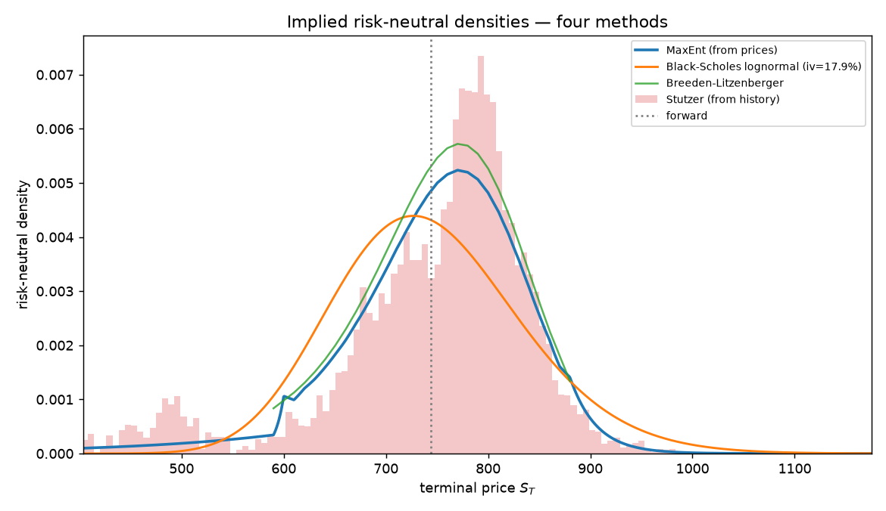
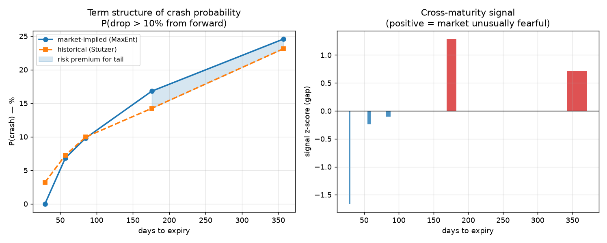

# Information-Theoretic Option Pricing

Recovers the market-implied probability distribution from SPY option prices
using maximum-entropy and minimum-cross-entropy methods, and compares the
result to the Black-Scholes lognormal model.

## Summary

Black-Scholes assumes the future stock price is lognormally distributed.
A lognormal distribution always has positive skew, regardless of the
volatility parameter. Using maximum-entropy density recovery on a live SPY
option chain at 180-day expiry, I extracted the actual risk-neutral density
the market is pricing and found:

- **Market-implied skew: −1.86** vs Black-Scholes' **+0.37**. The market's
  distribution is left-asymmetric (the volatility smirk). No lognormal can
  produce this shape.
- Two independent methods (maximum-entropy and Breeden-Litzenberger) recover
  visually overlapping densities from the same prices. The result reflects
  the prices rather than the choice of method.
- Across the maturity curve (30d to 365d), market-implied and historical
  crash probabilities agree at short maturities and diverge at longer ones,
  with the market pricing 1 to 3 percentage points of additional risk
  premium at 6 to 12 month horizons.



## What it does

An option chain implies a probability distribution over the future stock
price through the prices it quotes. The distribution is never written down
directly. This project recovers it from the prices.

The recovery is underdetermined: roughly 30 observed option prices versus a
continuous density, so infinitely many densities fit. The project applies
Jaynes' maximum entropy principle to pick one: the density consistent with
every observed price that adds no structure the prices don't force.

## Math

For any payoff `g(S_T)`, no-arbitrage pricing gives

```
price = exp(-rT) · E_Q[g(S_T)]
```

where `Q` is the risk-neutral measure. An option chain is therefore a set of
constraints on the risk-neutral density `f_Q`:

```
E_Q[S_T]            = S_0 · exp((r-q)T)              (martingale / forward)
E_Q[(S_T - K_j)^+]  = C_j · exp(rT)    for each j    (each option price)
∫ f_Q(S) dS         = 1                              (normalization)
```

The maximum-entropy density solves

```
maximize   H[f] = -∫ f(S) log f(S) dS    s.t.    ∫ g_i(S) f(S) dS = μ_i
```

Variational calculus gives the Gibbs exponential-family solution
`f(S) ∝ exp(-Σ λ_i g_i(S))`, with multipliers found by minimizing the
convex dual

```
Ψ(λ) = log Z(λ) + Σ λ_i μ_i,    ∇Ψ = μ - E_f[g]
```

Setting the gradient to zero re-imposes the constraints. L-BFGS-B with
analytic gradients converges to gradient norm 1e-5 in milliseconds.

Stutzer's method is the cross-entropy analog: minimize KL divergence from
the empirical historical distribution subject to the martingale constraint.
The solution is exponential tilting of the historical sample with one
scalar parameter γ, which has an interpretation as the risk premium.

## Methods compared

| Method | Source | Assumption |
|---|---|---|
| Black-Scholes lognormal | Parametric | Single volatility, lognormal `S_T` |
| Breeden-Litzenberger | `f_Q(K) = exp(rT) · ∂²C/∂K²` | None (no-arbitrage only) |
| **Maximum entropy** | **Convex optimization on prices** | **Maximum entropy** |
| Stutzer canonical valuation | Exponential tilt of history | History resembles future |

Breeden-Litzenberger is model-free but numerically fragile: twice-
differentiating noisy quotes amplifies noise. MaxEnt is the robust
alternative. Fed identical inputs they agree closely, which validates that
the recovered shape is a property of the prices rather than the method.

## Result: density shape

```
[SPY] spot=744.39  expiry=2026-12-18 (T=0.490y, 179d)
ATM implied vol           : 0.1757
MaxEnt repricing RMSE     : 8.331e-04        ← prices recovered to <$0.001
Stutzer tilt gamma        : -14.0117         ← market's risk premium
MaxEnt mean vs forward    : 754.30 vs 754.31 ← martingale constraint satisfied

  method            std     skew   P(drop>10%)  P(drop>20%)
  ----------------------------------------------------------
  MaxEnt           101.6  -1.86      16.02%        5.03%
  Black-Scholes     93.2  +0.37      21.31%        3.99%
  ----------------------------------------------------------
```

The market-implied density is left-skewed; the lognormal cannot be. A
lognormal has positive skewness for any volatility and maturity, so the
shape the market prices is outside the lognormal family entirely.

## Term structure of the tail risk premium

A single-maturity snapshot is one number; running the recovery across
maturities adds an axis. Comparing market-implied probability of a 10% drop
to the historical estimate across 30/60/90/180/365 days, against 20 years
of SPY data (covering 2008, 2020, 2022):



```
   days   P_market  P_history     gap   ratio  signal_z
  ------------------------------------------------------
     31     0.00%     3.48%   -3.48%   0.00x   -1.75
     59     7.32%     7.12%   +0.20%   1.03x   -0.00
     87    10.20%    10.27%   -0.07%   0.99x   -0.13
    178    17.11%    14.36%   +2.76%   1.19x   +1.21
    359    24.83%    23.18%   +1.65%   1.07x   +0.68
```

Three regimes:

- **Short-dated (~30d): market less fearful than the 20-year base rate.**
  Market prices essentially zero probability of a 10% monthly drop against
  a long-run base rate of 3.5%. Consistent with the current low-volatility
  regime (ATM IV around 17.6%); short-dated options price the regime, not
  the long-run mixture.
- **Intermediate (60–90d): market and history agree to within 0.5pp.** Not
  where the market charges meaningful risk premium for routine drawdowns.
- **Long-dated (180–365d): market prices 1–3pp above history.** The
  variance risk premium concentrates here, where the market has to price
  in regime change, recessions, election cycles, and other slow-moving
  catalysts the recent environment doesn't reflect.

The sign flip across maturities is the headline. "Market prices fear above
history" holds only at intermediate-to-long horizons; at short horizons it
reverses, and at moderate horizons the two are essentially equal.

## Engineering

The MaxEnt solve diverged on raw market quotes. Real option mids aren't
perfectly arbitrage-free, and hard-equality entropy maximization has no
solution when the constraints are mutually inconsistent. What worked:

1. **OTM options only** (puts below the forward, calls above). ITM quotes
   are wide and illiquid; their mids distort the recovery.
2. **Convert OTM puts to call-equivalent prices via put-call parity**.
   Parity is a no-arbitrage identity, so the conversion is model-free.
3. **Invert to implied volatility, fit a smooth smile (quadratic in
   log-moneyness), regenerate clean Black-Scholes prices on an even strike
   grid.** The smile fit averages out quote noise and enforces internal
   consistency.
4. **MaxEnt on the smoothed prices.** Repricing RMSE drops from roughly
   $1,500 on raw quotes to under $0.001 with this preprocessing.

Other implementation details: constraint scaling so deep-money strikes
don't dominate the optimizer's conditioning; `logsumexp` for numerical
stability of the Gibbs partition function; analytic gradients to L-BFGS-B;
cubic-spline interpolation for Breeden-Litzenberger so its second
derivative is smooth; offline synthetic validation against a known
ground-truth density before any live data enters the pipeline.

## Repo layout

```
option_pricing.py        # methods, pipeline, drivers
densities.png            # density-comparison plot
term_structure.png       # term-structure analysis
term_structure.csv       # term-structure raw numbers
README.md
```

## Running

```bash
pip install numpy scipy matplotlib yfinance
python3 option_pricing.py
```

Default config pulls a live SPY chain at five maturities (~30, 60, 90, 180,
365 days) and runs the full pipeline at each. Edit the bottom of
`option_pricing.py` to switch to the single-maturity density-comparison
driver, change tickers, or run the offline synthetic-market validation.

## Limitations

- **Historical sample mixes regimes.** Stutzer's empirical density averages
  20 years that include calm and stressed periods; the current regime is
  one draw from that mixture, not the average. The short-maturity gap
  partly reflects this. A regime-matched historical window (filtering on
  VIX, trend, macro conditions) would tighten the comparison but is a
  separate project.
- **No historical time series of the gap.** yfinance only serves current
  option chains; a weekly history of the market-vs-history gap requires a
  paid or registered historical-options source (Polygon.io, OptionMetrics).
  The term-structure analysis is the within-snapshot version. Porting to
  Polygon is straightforward: the recovery code is unchanged, only
  `load_real_market` needs a new data backend.
- **Skewness magnitude depends on left-tail extrapolation.** The sign of
  the skew is robust and reproduces a documented feature of equity-index
  options; the precise value of −1.86 will move with the smile-fit window
  and entropy prior. A quantile-based skew measure would be more robust.
- **Quadratic smile fit is the simplest reasonable choice.** SVI or SSVI
  parametrizations are the industry standard and would extrapolate the
  wings more reliably, especially at longer maturities where OTM quote
  counts thin out (the 178d and 359d runs use ~66 quotes, vs ~200 for
  shorter maturities).
- **MaxEnt with hard equality constraints is brittle to arbitrage-
  violating inputs.** The smile-fit step is what makes it work on live
  data; without it the optimizer diverges. A relaxed formulation (entropy
  plus an L2 penalty on price errors) would degrade more gracefully.

## References

- Buchen, P. & Kelly, M. (1996). "The maximum entropy distribution of an
  asset inferred from option prices." *Journal of Financial and
  Quantitative Analysis.*
- Stutzer, M. (1996). "A simple nonparametric approach to derivative
  security valuation." *Journal of Finance.*
- Breeden, D. & Litzenberger, R. (1978). "Prices of state-contingent
  claims implicit in option prices." *Journal of Business.*
- Jaynes, E. T. (1957). "Information theory and statistical mechanics."
  *Physical Review.*
- Bakshi, G., Kapadia, N. & Madan, D. (2003). "Stock return characteristics,
  skew laws, and the differential pricing of individual equity options."
  *Review of Financial Studies.*
